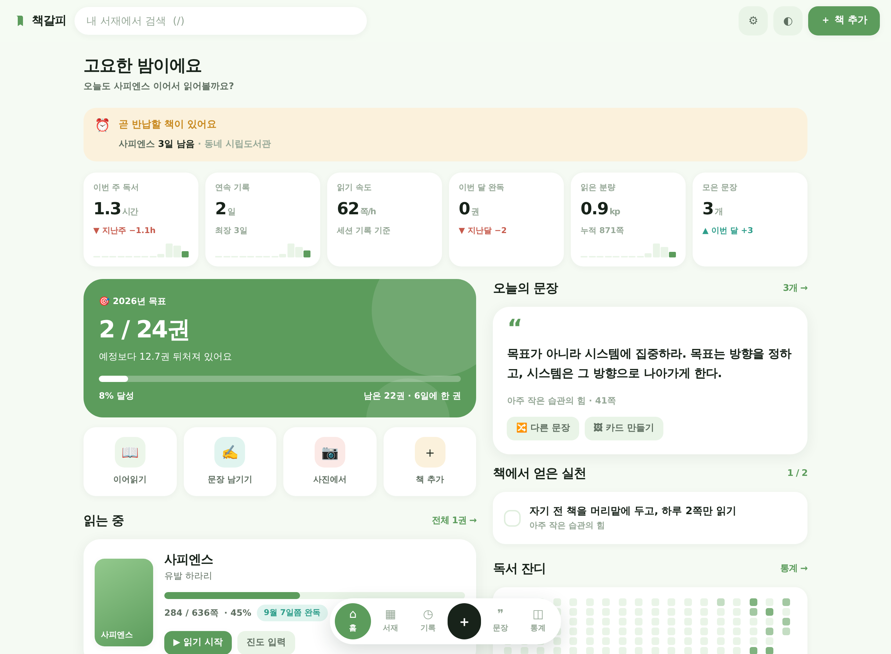
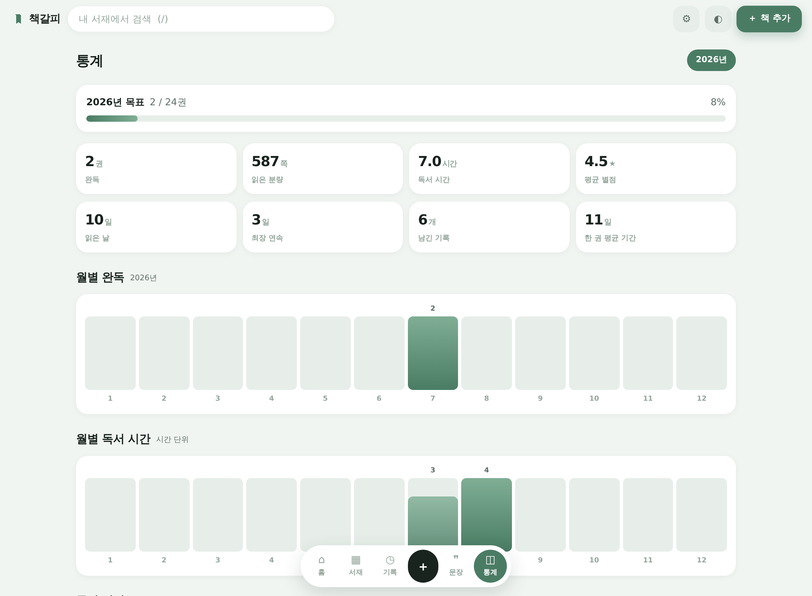
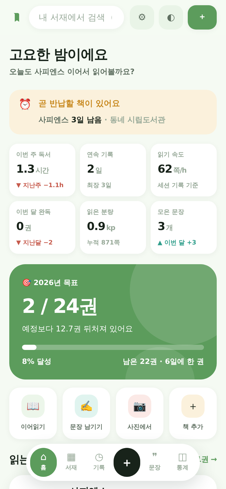
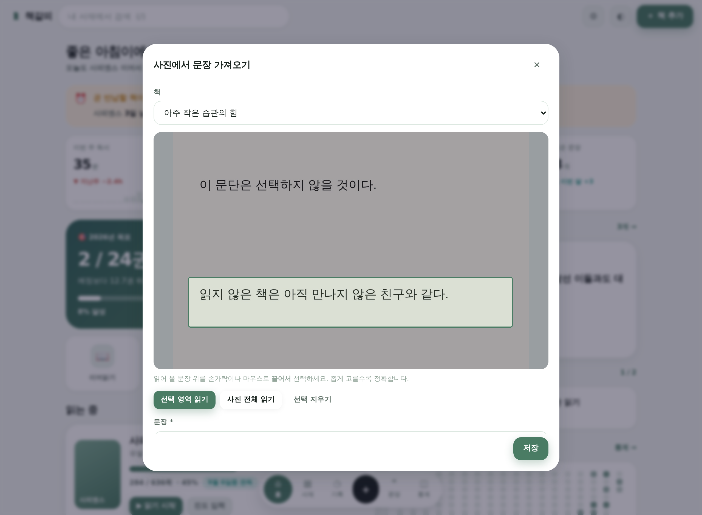
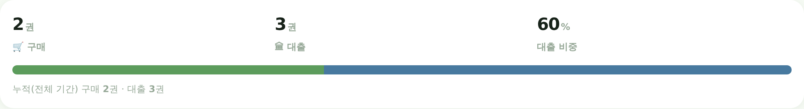

# 책갈피 — 독서기록 앱

읽은 책이 아니라 **읽은 시간**을 남기는 개인 독서 기록 앱.
모바일·PC 브라우저 어디서나 열리는 정적 웹앱(PWA)이며, 서버 없이 브라우저 안에만 데이터를 저장합니다.

<p align="center"></p>
<p align="center">
  
  
</p>

---

## 왜 또 하나의 독서앱인가

기존 앱들은 대부분 **"몇 권 읽었나"** 를 센다. 그런데 정작 습관을 만드는 건 권수가 아니라
매일의 짧은 독서 시간, 다시 꺼내 보는 문장, 책에서 건져 올린 한 가지 실천이다.
책갈피는 그 세 가지에 초점을 맞췄다.

**기존 앱에서 가져온 좋은 점**

| 참고한 기능 | 책갈피에서의 구현 |
|---|---|
| 책 검색·표지 자동 등록 | 알라딘·카카오·Google Books 중 선택 (기본은 키가 필요 없는 Google Books), ISBN 바코드 스캔 |
| 내가 찍은 표지 | 공식 표지와 별개로 **내 책 사진 한 장**을 붙이고, 목록에 무엇을 보여줄지 고를 수 있음 |
| 서재/책장 분류 | 읽는 중 · 읽고 싶은 · 완독 · 잠시 멈춤 · 중단 5단계 + 태그·우선순위 |
| 별점과 리뷰 | 별점, 한 줄 평, 자유 감상 |
| 연간 목표 | 목표 권수 + **진행 속도(페이스) 비교** |
| 인용 수집 | 인용 · 메모 · 실천 3종 기록, 쪽수/태그, **사진에서 글자 읽어오기** |
| 통계 대시보드 | 월별 완독·독서시간, 분류 비중, 저자 랭킹, 별점 분포, **구매/대출 비중과 자주 간 곳** |

**책갈피만의 것 — 차별화 10가지**

1. **독서 세션 타이머** — 읽기 시작/종료를 재고, 몇 쪽에서 몇 쪽까지 읽었는지 함께 남깁니다.
   화면을 옮기거나 새로고침해도 타이머는 계속 돌아갑니다.
2. **읽기 속도 → 완독 예상일** — 세션 기록에서 분당 페이지 속도를 계산해
   *"남은 352쪽, 이 속도라면 9월 3일쯤 완독"* 처럼 알려줍니다.
3. **목표 페이스메이커** — 단순 진행률이 아니라 오늘 날짜 기준으로
   *"예정보다 1.4권 앞서고 있어요"* / *"남은 8권, 한 권에 12일씩이면 달성"* 을 계산합니다.
4. **독서 잔디(히트맵)와 연속 기록일** — 하루라도 읽으면 칸이 채워집니다. 현재/최장 연속일 표시.
5. **오늘의 문장** — 모아 둔 인용 중 하나를 매일 다시 꺼내 보여 줍니다.
   덜 본 문장을 우선 고르는 가벼운 간격 반복(spaced repetition).
6. **인용 카드 이미지** — 문장을 배경/비율을 골라 PNG 카드로 만들어 저장·공유합니다.
7. **실천 카드** — 완독 회고에서 *"이 책에서 실천할 것"* 을 줄 단위로 적으면
   체크리스트가 되어 홈에 뜹니다. 읽고 끝나지 않게 하는 장치.
8. **내가 찍은 표지** — 온라인 표지와 별개로, 실제로 읽은 내 책을 찍어 붙입니다.
   장변 1600px로 자동으로 줄여 저장하고, 목록에 어느 쪽을 보여줄지 고를 수 있습니다.
9. **사진에서 문장 가져오기** — 책장을 찍고 **읽어 올 문장만 끌어서 선택**하면
   그 부분의 글자를 읽어 옵니다. 인식은 **전부 기기 안에서** 이루어져 사진이 밖으로 나가지 않고,
   비행기 안에서도 동작합니다. 원본 사진은 문장과 함께 보관할 수 있습니다.
10. **샀는지 빌렸는지, 그리고 반납일** — 책마다 구매/대출을 구분하고 구매처나 빌린 도서관을 적어 둡니다.
    *"올해 구매 8권 · 대출 12권, 주로 가는 곳은 시립도서관"* 처럼 쌓이고,
    빌린 책은 **반납일이 다가오면 홈에서 먼저 알려 줍니다.**

---

## 바로 써 보기

정적 파일만 있으면 되므로 아무 웹서버에서나 동작합니다.

```bash
git clone https://github.com/donniehong/read-app-by-claude.git
cd read-app-by-claude
python3 -m http.server 8000     # 또는  npx serve .
# 브라우저에서 http://localhost:8000
```

> ES 모듈을 쓰기 때문에 `index.html`을 **파일로 직접 열면(`file://`) 동작하지 않습니다.**
> 반드시 웹서버로 여세요.

### GitHub Pages로 배포

저장소 **Settings → Pages → Source: Deploy from a branch** 에서
브랜치와 `/ (root)` 를 고르면 끝입니다. 빌드 과정이 없습니다.
(`.nojekyll` 파일이 포함되어 있어 Jekyll 처리를 건너뜁니다.)

### 휴대폰에 설치

배포된 주소를 모바일 브라우저에서 열고
**공유 → 홈 화면에 추가**(iOS) 또는 **앱 설치**(Android/Chrome).
설치하면 오프라인에서도 열리고, 주소창 없는 전체 화면으로 실행됩니다.

---

## 처음 사용법

1. **설정 → 샘플 데이터 넣어보기** 로 기능을 먼저 둘러보세요. (나중에 전체 초기화 가능)
2. 상단 **＋ 책 추가** → 제목이나 저자로 검색 → 서재에 담기.
   검색이 안 되는 책은 *"검색 없이 직접 입력"* 으로 등록합니다.
3. 책을 열고 **⏱ 읽기 시작** → 다 읽으면 **종료** → 시간과 페이지를 저장.
4. 마음에 남은 문장은 **✍️ 기록** 으로 직접 적거나, **📷 사진에서** 로 책장을 찍어
   읽어 올 부분만 끌어서 선택하세요. 다음 날 홈에서 다시 만나게 됩니다.
5. 다 읽으면 **완독** → 별점 · 한 줄 평 · **실천할 것** 을 남기세요.

### 단축키 (PC)

| 키 | 동작 |
|---|---|
| `/` | 검색창으로 이동 |
| `N` | 책 추가 |
| `Q` | 문장 기록 |
| `T` | 밝게/어둡게 전환 |
| `1`~`5` | 홈 · 서재 · 기록 · 문장 · 통계 |
| `Esc` | 창 닫기 |

---

## 데이터와 프라이버시

- 모든 기록은 **이 브라우저의 IndexedDB** 에만 저장됩니다. 계정도, 서버도 없습니다.
  (IndexedDB를 쓸 수 없는 환경에서는 localStorage로 자동 폴백)
- 외부로 나가는 통신은 **책을 검색할 때의 도서 API 요청과 표지 이미지** 뿐입니다.
- 카카오 REST 키를 넣더라도 브라우저 안에만 저장되며 어디로도 전송되지 않습니다.
- **직접 찍은 사진도 백업에 함께 담깁니다.** 내보내기 버튼에 예상 용량이 표시되니
  파일이 커지는 것을 미리 알 수 있습니다.
- **브라우저 데이터를 지우면 기록도 사라집니다.** 설정에서 주기적으로
  **JSON 내보내기** 로 백업하세요. 다른 기기에서는 *가져오기(합치기)* 로 이어서 쓸 수 있습니다.
  (합치기는 ISBN 또는 제목+저자로 중복을 걸러냅니다.)
- 서재 목록만 필요하면 **CSV 내보내기** 도 지원합니다.

---

## 검색 공급자

| | Google Books (기본) | 알라딘 | 카카오 책검색 |
|---|---|---|---|
| API 키 | 불필요 | TTB 키 필요 (알라딘 로그인 후 발급) | REST 키 필요 |
| 국내서 정확도 | 보통 | 높음 | 높음 |
| 쪽수 제공 | 있을 때만 | ○ | ✗ (직접 입력) |
| 표지 화질 | 낮음(약 128px) | 높음 | 보통 |

설정 → 책 검색에서 고를 수 있고, 앞 순위가 실패하면 **자동으로 Google Books 로 내려갑니다.**

> **알라딘·카카오는 브라우저에서 막힐 수 있습니다.** 두 API 모두 서버에서 호출하는 것을 전제로
> 만들어져 있어, 서버 없는 이 앱에서 부르면 CORS 로 차단될 수 있습니다.
> 설정의 **연결 테스트** 버튼을 누르면 사용자의 브라우저에서 실제로 되는지 바로 알려줍니다.
> 키는 이 브라우저에만 저장되며 저장소나 코드에는 들어가지 않습니다.

---

## 구조

빌드 도구·프레임워크·외부 라이브러리 없이 순수 ES 모듈로 작성했습니다.
차트도 SVG를 직접 그립니다.

```
index.html                앱 셸 (상단바 · 사이드/탭 내비 · 뷰 컨테이너)
css/styles.css            디자인 토큰 + 전체 스타일 (라이트/다크)
manifest.webmanifest      PWA 매니페스트
sw.js                     서비스 워커 (앱 셸 캐시 · 표지 이미지 캐시)
js/
  app.js                  부트스트랩 · 라우팅 · 단축키
  router.js               해시 라우터
  store.js                상태 · 영속화 · 파생 계산(진도/속도/예상/스트릭)
  db.js                   IndexedDB 래퍼 (+ localStorage 폴백)
  search.js               도서 검색 (알라딘 / 카카오 / Google Books, 자동 폴백)
  image.js                사진 줄이기·고르기
  ocr.js                  사진 글자 인식 (기기 안에서 처리)
  photonote.js            사진에서 문장 가져오기 화면
  ui.js                   모달 · 토스트 · 별점 · 표지 등 공용 조각
  dialogs.js              책 추가/수정 · 진도 · 완독 회고 · 노트 편집
  timer.js                독서 세션 타이머
  charts.js               막대 · 도넛 · 순위 · 히트맵 (SVG)
  quotecard.js            인용 카드 이미지 생성 (Canvas)
  theme.js                라이트/다크/시스템 테마
  demo.js                 샘플 데이터
  views/                  home · library · book · timeline · notes · stats · settings
vendor/tesseract/         동봉한 OCR 엔진 (약 4.6MB, Apache-2.0)
```

### 데이터 모델 요약

```js
Book    { id, title, authors[], publisher, pageCount, isbn, categories[],
          cover,            // API 가 준 공식 표지 (주소)
          photo,            // 내가 찍은 사진 {id, bytes, w, h}
          coverPref,        // 목록에 무엇을 보여줄지: 'photo' | 'official'
          status, rating, review, oneLine, rereadIntent, startedAt, finishedAt,
          currentPage, tags[], priority, readCount, addedAt, updatedAt }
Image   { id, dataUrl, bytes, w, h, createdAt }   // 사진은 따로 보관해 필요할 때만 읽는다
Note    { id, bookId, type: 'quote'|'memo'|'action', text, comment, page, tags[],
          photo,            // 문장을 찍은 사진 (선택)
          done, recallCount, lastRecalledAt, createdAt }
Session { id, bookId, date, startedAt, endedAt, minutes, startPage, endPage, memo }
Meta    settings / goal:<연도>
```

---

## 사진에서 문장 가져오기

<p align="center"></p>

책장을 찍어 올리고, 옮겨 적고 싶은 문장 위를 **끌어서 선택**하면 그 부분만 읽습니다.
영역을 좁게 고를수록 정확합니다.

- **사진은 기기 밖으로 나가지 않습니다.** 인식 엔진(약 4.6MB)을 앱에 함께 담아
  브라우저 안에서 처리하므로, 오프라인에서도 동작하고 어떤 서버로도 사진이 전송되지 않습니다.
- 엔진은 이 기능을 처음 쓸 때 한 번 읽어 들입니다. 이후에는 바로 동작합니다.
- **인식 결과는 반드시 확인해 주세요.** 깨끗한 글자는 잘 읽지만, 조명이 고르지 않거나
  책이 굽어 있으면 틀리게 읽습니다. 그래서 결과를 바로 저장하지 않고 **고칠 수 있는 칸**에 넣어 줍니다.
- WebAssembly SIMD 를 지원하지 않는 오래된 브라우저에서는 인식 버튼 대신 안내가 뜨고,
  사진 보관과 직접 입력은 그대로 됩니다.

---

## 구매와 대출

<p align="center"></p>

책 정보에서 **어디서 온 책**을 고르면 옆 칸이 그에 맞게 바뀝니다.
구매를 고르면 *구매처*(교보문고 등), 대출을 고르면 *빌린 곳*(○○도서관)을 묻고,
날짜는 오늘로 채워집니다. 한 번 적은 곳은 다음부터 **자동완성**으로 뜹니다.

통계에서는 선택한 해의 구매/대출 권수와 비중, **누적(전체 기간)**, 그리고
**자주 간 곳 순위**를 볼 수 있습니다. 서재 검색창에 도서관 이름을 넣으면
거기서 빌린 책만 모아 볼 수도 있습니다.

> 날짜를 비워 두면 **서재에 담은 날**을 기준으로 집계합니다.

### 반납일 챙기기

<p align="center"></p>

대출을 고르면 **반납 예정일** 칸이 함께 나오고, 흔한 대출 기간인 **2주 뒤**로 채워집니다(고칠 수 있습니다).

- 반납이 **일주일 안으로 다가오면 홈 맨 위에 알림**이 뜹니다. 기한이 지난 책이 있으면 붉은색으로 바뀝니다.
- 알림의 책 이름을 누르면 바로 그 책으로 갑니다.
- 다 읽고 돌려줬으면 책 상세에서 **📕 반납 완료** — 알림에서 사라지고 반납한 날이 남습니다.
  잘못 눌렀으면 **반납 취소**로 되돌립니다.

---

## 브라우저 지원

Chrome · Edge · Safari · Firefox 최신 버전 (데스크톱/모바일).
바코드 스캔은 `BarcodeDetector` 를 지원하는 브라우저(주로 Android Chrome)에서만 버튼이 나타납니다.
`color-mix()` 를 사용하므로 아주 오래된 브라우저에서는 일부 색이 다르게 보일 수 있습니다.
