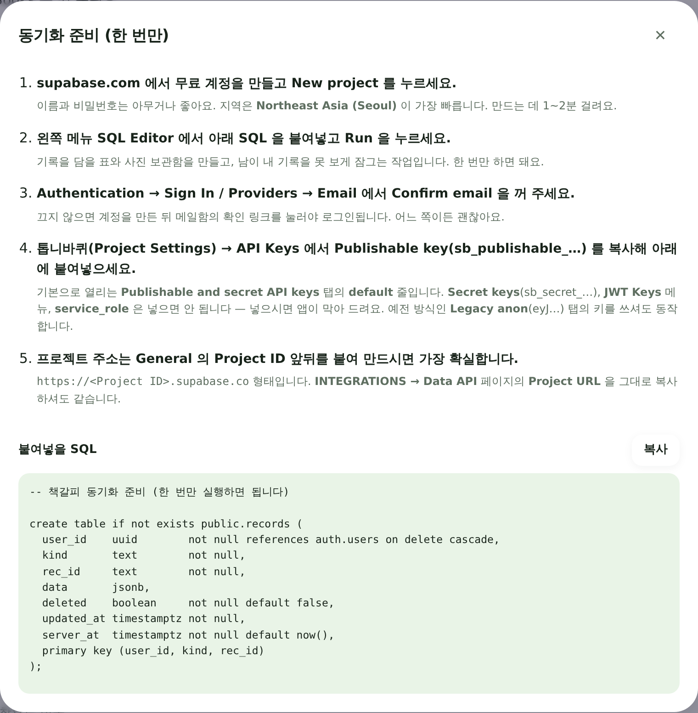

# 기기 간 동기화 준비하기

PC에서 적은 기록을 휴대폰에서도 그대로 보려면, 기록을 놓아둘 곳이 하나 필요합니다.
이 앱은 **Supabase** 라는 무료 서비스를 창고로 씁니다. 준비는 처음 한 번뿐이고, 10분이면 끝납니다.

> 앱 안에서도 같은 안내를 볼 수 있습니다. **설정 → 기기 간 동기화 → 준비 방법 보기**

<p align="center"></p>

---

## 1. Supabase 프로젝트 만들기

1. [supabase.com](https://supabase.com) 에서 무료 계정을 만듭니다 (GitHub 계정으로 바로 가입됩니다).
2. **New project** 를 누릅니다.
3. 이름은 아무거나(예: `chaekgalpi`), **Database Password** 는 적당히 길게 정하고 어딘가 적어 둡니다.
   이 비밀번호는 앱에서 쓰지 않지만, 나중에 데이터베이스를 직접 열 때 필요합니다.
4. **Region** 은 `Northeast Asia (Seoul)` 이 가장 빠릅니다.
5. 프로젝트가 준비되기까지 1~2분 걸립니다.

무료 요금제로 데이터베이스 500MB, 사진 보관함 1GB를 쓸 수 있습니다.
책 수천 권과 사진 수천 장이 들어가는 크기라, 개인 독서기록에는 넉넉합니다.
신용카드는 필요 없습니다.

## 2. 표와 사진 보관함 만들기 (SQL 한 번 실행)

왼쪽 메뉴에서 **SQL Editor** 를 열고, 아래 내용을 통째로 붙여넣은 뒤 **Run** 을 누릅니다.

<details>
<summary>붙여넣을 SQL (앱의 <b>준비 방법 보기 → 복사</b> 버튼으로도 그대로 복사됩니다)</summary>

```sql
-- 책갈피 동기화 준비 (한 번만 실행하면 됩니다)

create table if not exists public.records (
  user_id    uuid        not null references auth.users on delete cascade,
  kind       text        not null,
  rec_id     text        not null,
  data       jsonb,
  deleted    boolean     not null default false,
  updated_at timestamptz not null,
  server_at  timestamptz not null default now(),
  primary key (user_id, kind, rec_id)
);

create index if not exists records_sync_idx on public.records (user_id, server_at);

-- 도착 순서는 서버가 직접 찍는다. 기기 시계가 틀려도 빠뜨리지 않기 위해서다.
create or replace function public.records_stamp() returns trigger
language plpgsql as $$
begin
  new.server_at := now();
  return new;
end $$;

drop trigger if exists records_stamp on public.records;
create trigger records_stamp before insert or update on public.records
  for each row execute function public.records_stamp();

-- 내 기록은 나만 보고 나만 고친다
alter table public.records enable row level security;
drop policy if exists "own records" on public.records;
create policy "own records" on public.records
  for all using (auth.uid() = user_id) with check (auth.uid() = user_id);

-- 사진 보관함 (비공개)
insert into storage.buckets (id, name, public)
values ('photos', 'photos', false)
on conflict (id) do nothing;

drop policy if exists "own photos" on storage.objects;
create policy "own photos" on storage.objects
  for all to authenticated
  using (bucket_id = 'photos' and (storage.foldername(name))[1] = auth.uid()::text)
  with check (bucket_id = 'photos' and (storage.foldername(name))[1] = auth.uid()::text);
```

</details>

이 SQL 이 하는 일은 세 가지입니다.

- 기록을 담을 표(`records`)와 사진 보관함(`photos`)을 만듭니다.
- **Row Level Security** 로 잠급니다 — 로그인한 본인의 기록만 읽고 쓸 수 있습니다.
- 기록이 도착한 순서를 서버가 직접 찍게 합니다. 기기 시계가 조금 틀려도 기록을 빠뜨리지 않기 위해서입니다.

`Success. No rows returned` 이 나오면 된 겁니다.

## 3. 로그인 방식 정하기 (선택)

**Authentication → Sign In / Providers → Email** 에서 **Confirm email** 을 꺼 두면
계정을 만들자마자 바로 쓸 수 있습니다.

켜 둔 채로 두어도 괜찮습니다. 그 경우 계정을 만든 뒤 메일함의 확인 링크를 한 번 누르고,
앱에서 **로그인** 버튼을 누르면 됩니다.

## 4. 앱에 주소와 키 넣기

왼쪽 아래 **톱니바퀴(Project Settings)** 를 누르면 `CONFIGURATION` · `INTEGRATIONS` · `BILLING`
세 묶음이 나옵니다. **`API` 라는 메뉴는 없습니다.** 주소와 키가 서로 다른 곳에 있습니다.

### ① 공개 키 — `CONFIGURATION` → **API Keys**

들어가면 위쪽에 탭이 두 개 있습니다. 기본으로 열리는 **`Publishable and secret API keys`** 탭에서
**Publishable key** 아래 `default` 줄의 값을 복사하세요. `sb_publishable_…` 로 시작합니다.
(값 오른쪽 복사 아이콘을 누르면 됩니다.)

Supabase 도 이 키 옆에 이렇게 적어 두었습니다 — *"This key is safe to be used in a browser
if you have enabled Row Level Security (RLS)"*. 2번에서 건 규칙이 바로 그 RLS 입니다.

| 화면에서 보이는 것 | 이 앱에 넣나 |
|---|---|
| **Publishable key** — `sb_publishable_…` | ○ **이것을 넣으세요** |
| **Secret keys** — `sb_secret_…` | ✗ 절대 안 됩니다 |
| `Legacy anon, service_role API keys` 탭의 **anon** — `eyJ…` | △ 예전 방식. 이것도 동작합니다 |
| 왼쪽 메뉴의 **JWT Keys** | ✗ 다른 것입니다. 건드리지 마세요 |

### ② 프로젝트 주소

두 가지 방법 중 편한 쪽으로 하시면 됩니다.

**(가) `CONFIGURATION` → General 에서 만들기 (가장 확실함)**
**Project ID** 값을 복사한 뒤 앞뒤를 붙입니다.

```
https://<Project ID>.supabase.co
```

예를 들어 Project ID 가 `durteyxchqhyrpkaokkv` 라면
주소는 `https://durteyxchqhyrpkaokkv.supabase.co` 입니다.

**(나) `INTEGRATIONS` → Data API 에서 복사**
그 페이지의 **Project URL** 을 그대로 복사하면 됩니다.
(이 메뉴는 `CONFIGURATION` 이 아니라 그 아래 `INTEGRATIONS` 묶음에 있습니다.)

### ③ 앱에 붙여넣기

앱의 **설정 → 기기 간 동기화** 에 주소와 키를 넣고 **연결 확인** 을 누릅니다.
이어서 이메일과 비밀번호로 **계정 만들기** 를 누르면 끝입니다.

> **왜 공개 키는 브라우저에 넣어도 되나요?**
> 그 키는 "이 프로젝트에 말을 걸겠다"는 표찰일 뿐, 문을 여는 열쇠가 아닙니다.
> 실제 잠금은 2번에서 건 규칙(Row Level Security)이 하고, 로그인한 본인의 기록만 열립니다.
> 반면 **Secret · service_role 키는 그 잠금을 통째로 무시합니다.**
> 실수로 넣으시면 앱이 알아보고 막아 드립니다.

## 5. 다른 기기에서

휴대폰 브라우저로 같은 주소를 열고, **설정 → 기기 간 동기화** 에서
**같은 프로젝트 주소·키·이메일·비밀번호**로 **로그인** 하면 됩니다.
잠시 뒤 PC의 기록이 그대로 나타납니다.

---

## 알아두면 좋은 것

**무엇이 오가나요**
책, 문장·메모·실천, 독서 세션, 연간 목표, 그리고 사진(표지 사진과 문장 사진)이 오갑니다.
테마나 화면 보기 방식 같은 기기 설정, 그리고 검색 API 키는 그 기기에만 남습니다.

**언제 오가나요**
기록을 고치면 몇 초 뒤에 한 번, 앱으로 돌아올 때 한 번, 그리고 90초마다 한 번씩 저절로 맞춥니다.
설정 화면의 **지금 동기화** 로 직접 시킬 수도 있습니다.

**인터넷이 없으면**
평소처럼 다 쓸 수 있습니다. 기록은 기기에 먼저 저장되고, 연결되면 밀린 것이 한꺼번에 올라갑니다.

**같은 책을 두 기기에서 동시에 고치면**
나중에 고친 쪽이 남습니다(책 단위로 판정합니다). 한쪽에서 지운 책은 다른 기기에서도 사라지고,
다시 살아나지 않습니다.

**기록은 안전한가요**
Supabase 프로젝트는 본인 것이고, 위 규칙 덕분에 로그인한 본인만 읽고 쓸 수 있습니다.
다만 기록이 기기 밖의 서버에 저장된다는 점은 분명히 알고 쓰시는 게 좋습니다.
동기화를 쓰더라도 **설정 → 데이터 → JSON 내보내기** 로 가끔 백업해 두시길 권합니다.

**동기화를 그만두고 싶으면**
**이 기기에서 로그아웃** 을 누르면 됩니다. 기기의 기록은 그대로 남습니다.
클라우드에 올라간 것까지 지우려면 Supabase 프로젝트를 삭제하세요.
